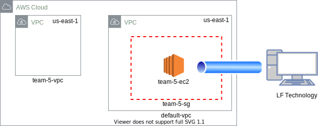

# Assignment AWS

### Requirements:

Region: `us-east-1` (because we are team number 5)

VPC CIDR: `10.15.40.0/22`

EC2 Instance:

AMI: `Amazon Linux 2`

Instance type: `t2.micro`

EBS Volume:

Type: `General`

Size: `10Gi`

Root Volume: `no` (should be detachable)

Tags: 

Team-Name: `intern-5`

Member1: `Bigyan Koirala`

Member2: `Roshan Rimal`

Member3: `Samana Pokhrel`

Name: `team-5-<resource-name>`

### Architecture diagram for the assignment:



## Q.1.

1.1 Change region to `us-east-1`


1.2 Create VPC

We create a VPC with CIDR 10.15.{8*team_number}.0/22 

Since we are team number 6 the required CIDR is `10.15.40.0/22`


1.3 Assign Name and CIDR to VPC


1.4 Tag the Resource


## Q.2.

​

2.1 Lauch EC2 Instance

​


​

2.1.1 Select AMI as Amazon Linux 2

​


​

2.1.2 Choose Instance type as t2.micro

​


​

2.1.3 Select the VPC to be default VPC

​


​

2.1.4 Add General Purpose detachable EBS volume

​


​

2.1.5 Tag the EC2 instance, along with the Volume  created above

​


​

2.1.6 Allow EC2 instance to be publicly accessible

​

Configure Security Group to allow SSH from everywhere

​


​

2.1.7 Review and Launch the Instance

​


​

2.1.8 Create `ssh` key-pair and download the private key to access the instance

​

Created keypair before launching the instance

​


​

2.1.9 Change the private key permission and connect to the EC2 instance

​

```bash

chmod 400 team-5-keypair.pem

ssh -i "team-5-keypair.pem" ec2-user@ec2-54-163-188-228.compute-1.amazonaws.com

```

​


​
