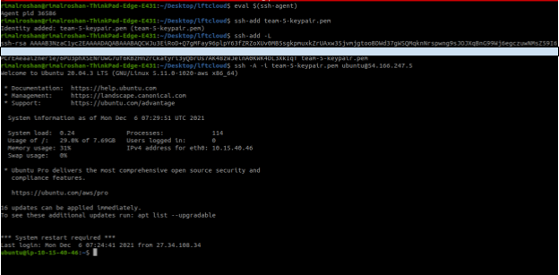

# Assignment VPC

### Requirements:

Region: `us-east-1` (because we are team number 5)

VPC CIDR: `10.15.40.0/22`

EC2 Instance:

AMI: `ubuntu`

Instance type: `t2.micro`

Tags: 

Team-Name: `intern-e`

Member1: `Bigyan Koirala`

Member2: `Roshan Rimal`

Member3: `Samana Pokhrel`

Name: `team-5-<resource-name>`

### Architecture diagram for the assignment:

.png)

### Address Allocation:

Given VPC CIDR: `10.15.40.0/22`

Total number of subnet (network): `6`

Since we need 6 networks we are good 3 network bits but to make this future proof we use one additional network bit than we need.

i.e Network bits=4

Total Number of Networks available=2^4=16

Subnet: `team-5-pub-1`

NID: `10.15.40.0/26`

Subnet: `team-5-pub-2`

NID: `10.15.40.64/26`

Subnet: `team-5-pub-3`

NID: `10.15.40.128/26`

Subnet: `team-5-pvt-1`

NID: `10.15.41.0/26`

Subnet: `team-5-pvt-2`

NID: `10.15.41.64/26`

Subnet: `team-5-pvt-3`

NID: `10.15.40.192/26`

The number of hosts available in each subnet is 2^(32-26)

  = 2^6-5

  = 59 hosts

which suffices for our purpose.

Verifying the subnets exist

```bash
aws ec2 describe-subnets  --filters "Name=vpc-id,Values=vpc-04cfc929ff078a5e6" | grep "\"CidrBlock\""
```


### Tasks

- Terminate previously created EC2


Click on `Terminate` to terminate the instance


Check that the instance is in `terminated` state:


Delete the corresponding EBS volume as well:

Find the volume from ec2 console:


(not authorized need to ask mahesh for the permission)

- (Optional) Enable VPC Flow Logs via CloudWatch Log.


- Create 3 subnets in each AZ to be used as public.
    
    
    

- Create 3 subnets in each AZ to be used as private.


- Create Public Route Table and associate public subnets.


- Create Private Route Table and associate private subnets.


- Create Internet Gateway and attach route to it in the public route table.


Attaching IGW to VPC


Adding route to Internet Gateway in Public Route Table


View that the IGW is associated with `team-5-vpc`


- Create NAT (and EIP for it) and attach route to NAT Gateway in Private Route Table.


Adding route in the private route table


Verify that EIP has been allocated to the NAT Gateway


- Create S3 VPC Endpoint and add its route to both public and private Route tables.

Creating  s3 endpoint.


Selecting the VPC


Configuring route tables to add s3's route to both private and public route tables


Tagging


Endpoint Created


View Endpoint


- Verify the connectivity through S3 VPC Endpoint

Check the route in the route tables

Public Route Table


Private Route Table


Install `aws` CLI in the private instance


Configure it with credentials (although this is not good practice we don't have permission for IAM Role)


Then remove the route to NAT gateway for private route table

New Private route table is as:


Try to access [google.com](http://google.com) from the instance it should timeout


Try to access s3 service from the private instance

```bash
aws s3 ls
```


- Create EC2 inside Public Subnet


Allow SSH ingress traffic for your own IPs only.


- Spin up simple http server @ 9099 port and verify it is accessible from public.

```docker
python3 -m http.server 9099
```


Allow inbound traffic on port 9099 in Security group


Access the web server from the browser


- Install and, open ports required to use it for these CIDR ranges: `27,43,45,72,103,110,112,124,139,150,163,202.0.0.0/8` and your own IPs

Install openvpn server

```docker
sudo apt update
sudo apt install openvpn
```


Open the required ports in linux firewall using `ufw`

```docker
sudo ufw allow 1194/udp
```


Open the required ports in Public Security Group

Only allow OpenVPN connection for these CIDR ranges

`27.0.0.0/8`

`43.0.0.0/8`

`45.0.0.0/8`

`72.0.0.0/8`

`103.0.0.0/8`

`110.0.0.0/8`

`112.0.0.0/8`

`124.0.0.0/8`

`139.0.0.0/8`

`150.0.0.0/8`

`163.0.0.0/8`

`202.0.0.0/8`

Script to add all those rules in the Security Group

```docker
#!/usr/bin/python3
prefix=[27,43,45,72,103,110,112,124,139,150,163,202]
ip=list(map(lambda a: str(a)+'.0.0.0/8',prefix))
print('{'+','.join(ip)+'}')
```


Adding Security Group Rules for the given CIDR

```bash
#!/bin/bash
for ip in {27.0.0.0/8,43.0.0.0/8,45.0.0.0/8,72.0.0.0/8,103.0.0.0/8,110.0.0.0/8,112.0.0.0/8,124.0.0.0/8,139.0.0.0/8,150.0.0.0/8,163.0.0.0/8,202.0.0.0/8}
do
aws ec2 authorize-security-group-ingress --group-id sg-0c5a36f528ca0731a --protocol udp --port 1194 --cidr $ip
done
```

Adding Security Group Ruled for our IP

```bash
#!/bin/bash
for ip in {103.10.29.114/32,27.34.108.34/32,27.34.13.232/32}
do
aws ec2 authorize-security-group-ingress --group-id sg-0c5a36f528ca0731a --protocol udp --port 1194 --cidr $ip
done
```


Verify that security group rules have been added in the console


- Launch another EC2 Instance in Private Subnet


View the Created instance


- Install `postgres` server in private ec2 instance

SSH into public EC2 instance with SSH-Agent Forwarding

Start the `ssh agent`

```docker
eval $(ssh-agent)
```

Add `team-5-keypair.pem` key to the agent

```docker
ssh-add team-5-keypair.pem
```

Verify that the key has been added

```docker
ssh-add -L
```

SSH to public instance with agent forwarding enabled

```docker
ssh -A -i team-5-keypair.pem ubuntu@54.166.247.5
```



- Configure Private Security group to allow `postgres` traffic (port `5432/tcp`only from VPC i.e `10.15.40.0/22`
- 


SSH into private EC2 instance

```docker
ssh ubuntu@10.15.40.239
```


- Allow `ssh` and `postgres` traffic on the firewall

```docker
sudo ufw allow 22/tcp
sudo ufw allow 5432/tcp
```


- Install postgresql

```bash
sudo apt update
sudo apt install postgresql postgresql-contrib
```


- Configure `postgres`

Insert/Modify the `postgres` configuration at `/etc/postgresql/12/main/postgresql.conf` in the private instance with the following

```docker
listen_addresses = '*' 
```

Insert/Modify  the following line in configuration file `/etc/postgresql/12/main/pg_hba.conf`:

`hostnossl    all          all            10.15.40.0/22  md5`


**This will allow only connections from the VPC.**

Exit out of the private instance into public instance again

Install `postgresql-client`

```docker
sudo apt-get install postgresql-client-12
```

Connect to `postgres` instance in the private instance from public instance

```docker
psql -h 10.15.40.239 -p 5432 -U postgres
```

