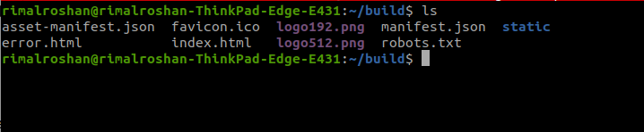

# cloud-day-4-lb-dns

- Create Application Load balancer
    - Start a simple server in private EC2 8880
    - Target ALB to serve that server
    - ALB should be accessible through port 80 listener
    - Health Check
        - Register healthy on 3 success
        - Register unhealthy on 5 success
        - Timeout 5 Seconds
        - Interval 45 Seconds
    - Access the server via ALB publicly using ALB’s DNS name.
- Create Route53 Hosted Zone
    - Either use your own Domain if you have as **<team-name>.<your-domain>** **OR** use mine ie [intern.amitj.com.np](https://console.aws.amazon.com/route53/v2/hostedzones#ListRecordSets/Z051165739T629IMV4ELJ) to create new HZ for your use in pattern **<team-name>.intern.amitj.com.np**.
    - Show nslookup result for your domain.
    - Add R53 entry to map above created ALB at URL **alb.<team-name>.<your-domain>**
- Create ACM for above created R53 HZ with both top subdomain and its wild card ie **<team-name>.<your-domain>** and ***.<team-name>.<your-domain>**
- Update ALB
    - Accept request only when **Host = alb.<team-name>.<your-domain>**, with default action response Code: 503, Message: “Unknown Request” on both HTTP and HTTPS requests.
    - Enable HTTPS support.
    - Redirect HTTP to HTTPS.
- (Optional) Create Private Route53 with domain **<team-name>.vpc-local** and attach it to your VPC with DNS resolve enable.
    - Add A Record to map Private EC2’s Private IP to **ec2.<team-name>.vpc-local**.

Run telnet

**ec2.<team-name>.vpc-local**

22, from public EC2 and verify it gets connected.

First We create an application load balancer as follows:



We give a name for our load balancer and make it internet facing.


We set the VPC as team5's VPC and subnets as our public subnets


we add a listener at port 80


After adding a listener at port 80 we edit our security group to allow incoming traffic at port 80


Now we create a target group for our ALB where the ALB routes requests to the targets in a target group.

For this, we choose the target type as instances


We set the target group name, port,VPC and protocol version as follows:


We specify the port the load balancer uses when performing health checks on targets as 8880.


we set the parameters for health check as per our requirement as follows:


we then register a target for the target group created above(where our target is our private ec2 instance)


reviewing targets:


Our created target group:


Our created target:


After setting up the target group and target our load balancer's configuration was found as follows:

The DNS name of our ALB is: [http://team-5-alb-1702691530.us-east-1.elb.amazonaws.com/](http://team-5-alb-1702691530.us-east-1.elb.amazonaws.com/)


We can see that the load balancer has a listener at port 80 which forwards the requests to the target group we created.


Now in our private ec2 instance, we create a simple index.html file 


Then, we serve the file at port 8880 using python3 as follows: 


we can access the created server using our created load balancer's DNS name(i.e. [http://team-5-alb-1702691530.us-east-1.elb.amazonaws.com/](http://team-5-alb-1702691530.us-east-1.elb.amazonaws.com/))


To keep the process running even after exiting the `ssh` session we issue the following command:

```bash
nohup python3 -m http.server 8880
```


Create route53 hosted zone


- Update the Nameservers to be Route 53 Nameservers


- Verify that the changes has been propagated


Completely Propagated


- Create another hosted zone for `team-5` subdomain of the above domain

    


Insert Alias Record in the form `alb.team-5.lftassignment.tk`


Check using DNS Checker Again


Access the Web Application using custom domain name


Create ACM for above created R53 HZ with both top subdomain and its wild card ie **<team-name>.<your-domain>** and ***.<team-name>.<your-domain>**

Create ACM certificate for `team-5.lftassignment.tk`


Create ACM certificate for `*.team-5.lftassignment.tk`


View the created certificates


- Update ALB to accept request only when **Host = alb.<team-name>.<your-domain> for** HTTP listener.
    
    
    
    

Verify 


- Update ALB to accept request only when **Host = alb.<team-name>.<your-domain> for** HTTPS listener.

Add SSL certificate to https listener when creating the listener


Serve the application only when host is `alb.team-5.lftassignment.tk`


Verify


- Set default action to send response Code: 503 with Message: “Unknown Request” on both HTTP and HTTPS requests.

  For HTTP requests


  

Checking the default action


For HTTPS requests


Checking the default action for HTTPS


- Redirect HTTP to HTTPS.


Check the certificates

 


- (Optional) Create Private Route53 with domain **<team-name>.vpc-local** and attach it to your VPC with DNS resolve enable.
    
    
    Enable DNS Resolution
    
    
    
    Enable DNS Hostname
    
    
    
    Create a private Route53 hosted zone
    
    
    
    Associate our VPC with the hosted zone
    
    
    

- (Optional) Add A Record to map Private EC2’s Private IP to **ec2.<team-name>.vpc-local**.


- (Optional) Run telnet **ec2.<team-name>.vpc-local** 22, from public EC2 and verify it gets connected.


